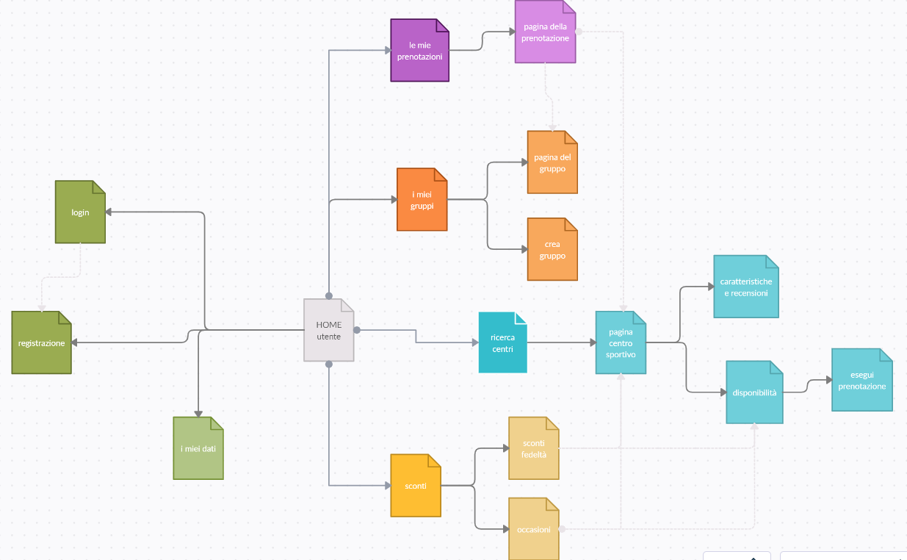

# “Sports center app”/ “SportsHub”
[__Site map__](https://app.creately.com/diagram/GaIQ1vdP28f/edit)  

## Funzionalità prioritarie
- *verde*:
    - registrarsi
    - fare login
    - vedere e modificare i propri dati
- *blu*:
    - trovare centri sportivi nelle vicinanze con campi di calcio (a 11, 7, 5), basket, pallavolo, tennis
    - vedere caratteristiche e recensioni della struttura
    - vedere le disponibilità dei campi
    - prenotare un campo a nome di un referente, eventualmente notificando un gruppo
- *viola*:
    - vedere un prospetto delle proprie prenotazioni
    - vedere le caratteristiche di una prenotazione: se sia associata a un gruppo, chi è il referente, chi ha pagato, etc
- *arancio*:
    - creare gruppo o unirsi a un gruppo esistente
    - vedere un prospetto dei propri gruppi
    - vedere le caratteristiche di un gruppo: i membri, le prenotazioni, etc
- *giallo*:
    - usufruire di sconti messi a disposizione dai centri sportivi
    - vedere quanto manca a ottenere uno sconto fedeltà

## Funzionalità aggiuntive
- *verde*:
    - login con Google, Facebook, etc
    - indicare il proprio livello atletico e tecnico in ogni sport
    - inicare in quali ruoli si è disponibili a giocare
- *blu*:
    - mettersi in lista d’attesa come individuo
    - pagare con Google Wallet, Satispay, etc
- *viola*:
    - vedere un prospetto delle proprie liste d'attesa
- *arancio*:
    - consultare i risultati di partite passate
    - gallerie di foto
    - chat
- *giallo*:
    - cercare campi scontati one-off disponibili

## Altre funzionalità per l'utente
- organizzare tornei
- possibilità di indicare utenti con cui si preferisce non giocare
- pagina con news sull’applicazione ed eventi sportivi

## Funzionalità per i gestori...
- mettere a disposizione diversi campi
- stabilire che tipi di sconto poter applicare
- vedere un prospetto degli slot dei propri campi

